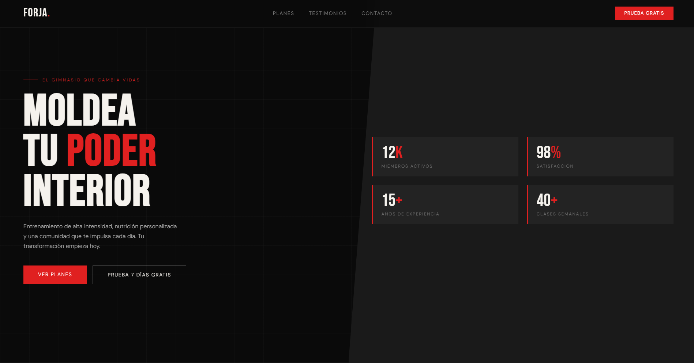

# Gym Landing Page

A modern and responsive gym landing page built with HTML, CSS, and JavaScript.

## Features

* Fully responsive design for desktop, tablet, and mobile devices
* Modern, clean, and fitness-focused UI
* Smooth scrolling navigation
* Interactive sections for services, pricing, and trainers
* High-performance and lightweight structure
* Conversion-oriented layout to attract new members

## Technologies Used

* HTML5
* CSS3
* JavaScript

## Preview

This project showcases a professional gym website designed to attract potential clients, present training programs, and improve user engagement through a clean and modern interface.

## Project Structure

```text
index.html
style.css
script.js
assets/
```

## Screenshot




## Author

Said Boushaba

GitHub: https://github.com/SaidBoushabaRahmouni
